# 基于国芯STC32F的智能汽车电池监护系统说明文档

## **一、系统介绍**

在全球汽车半导体市场被国际供应商主导的背景下，研发一款采用国产自主可控微控制器的汽车电池监护系统显得尤为重要。这一举措不仅可以强化技术独立性和供应链安全性，也促进国内汽车产业的创新与转型升级。

本系统是整合了传感技术和国芯STC32F微处理器处理能力，专为汽车电池的健康管理与性能监控设计。通过精准监测电池的压力、温度、周边气体等关键指标，并结合精密的数据分析算法，系统能够实时评估电池状态，一旦发现异常，迅速触发预警，确保车辆运行的安全性。

## **二、系统组成**

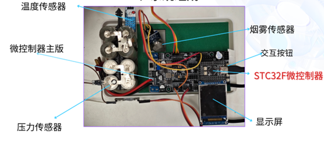

1. 核心控制器单元：采用国芯STC32F微控制器作为主控芯片，负责数据采集、处理、逻辑判断与输出控制。
2. 传感器模块：
   1. 温度传感器：监测电池工作环境及自身温度，预防过热风险。
   2. 压力传感器：监测电池工作环境及受迫压力，反应异常剐蹭或撞击情况。
   3. 烟雾传感器：测量电池周边气体变化，电池热失控时会有特殊的气体释放如氢气、一氧化碳、甲烷等。
3. 通信模块：STC32F自带两路汽车常用的CAN总线，也可通过附加模块兼容蓝牙及Wi-Fi等多种通讯方式，便于数据同步与远程操控。
4. 显示与报警单元：集成LCD显示屏及蜂鸣器，直观显示系统状态并提供声光报警。

## **三、功能特点**

1. 实时监控与可视化：LCD屏幕实时展示电池的关键参数，如压力、温度与气体浓度。
2. 智能分析与早期预警：运用高级算法，预测电池状态趋势，对异常情况如碰撞、高温及气体泄露立即报警。
3. 历史数据记录与分析：保留电池使用历史，便于追踪性能变化，辅助维护决策制定。
4. 便捷控制与系统管理：通过菜单界面监控电池状态，接收警报，调整系统配置。

## **四、安装与使用**

### 1. **安装步骤**

* 确保汽车熄火电源关闭，定位电池安装点。
* 固定监护系统，接通电源。本系统有两种电源连接方式：微处理器核心板USB口，主板电源插头。USB 2.0接口提供的功率大约为5V * 500mA = 2.5W，若主板上用电器超过了这个功率则应通过主板电源插头供电，供电电压DC7.2V~24V。

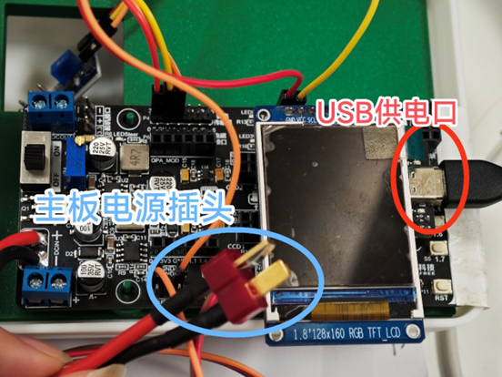

* 选择合适的通讯方式（详见“2.2.2 通信端控制”），完成设备连接。

### 2. **操作指南**

#### 2.1 数据查看

启动电源后，系统自动开始工作，数据通过LCD屏幕实时展示。

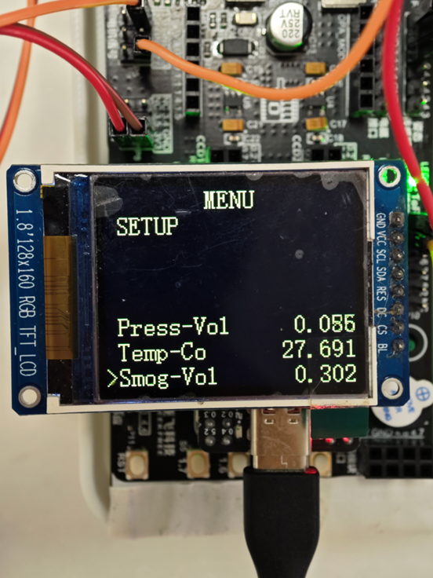

如果检测值超过了阈值将有对应的警告显示，同时蜂鸣器将高频警告响叫。

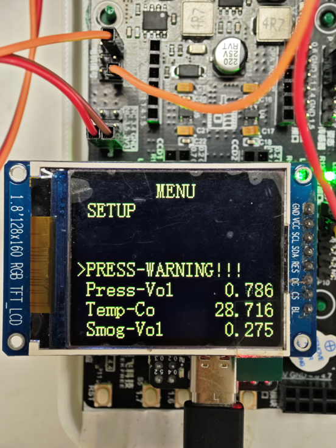

#### 2.2 UI菜单控制

##### 2.2.1 **本地端控制**

四键操作，包括光标上下移动、数值增减、菜单选择及返回功能。

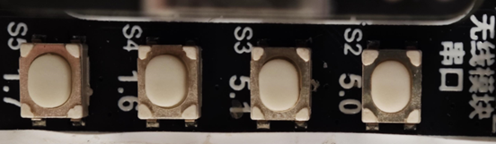

###### **按键1：**

一般情况：控制光标上移。

修改参数情况：加值。

###### **按键2：**

一般情况：控制光标下移动。

修改参数情况：减值。

###### **按键3：**

一般情况：确认进入菜单子页面。

修改参数情况：切换单次加减数值的单位。

###### **按键4：**

一般情况：返回上一级菜单。

主页面情况：进行EEPROM数据刷写保存模式。

##### 2.2.2 **通信端控制**

通过CAN总线或有线、无线通信模块发送特定数据帧，实现设备联动和远程设备控制。系统的默认串口通信波特率为115200，默认向串口上位机依次发送温度、浓度、压力、报警通知的数值。串口接收到字符串“Button1”、“Button2”、“Button3”、“Button4”时将控制对应按钮接口。

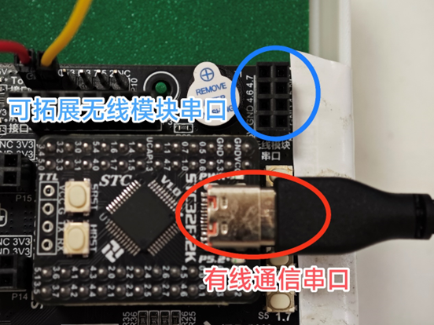

展示通信端获得的系统数据。

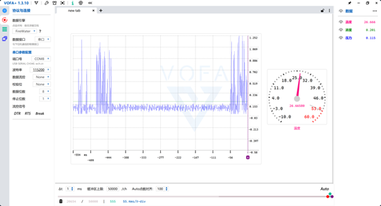

#### 2.3 报警阈值修改

在菜单的设置页面修改报警阈值，进行自定义配置。

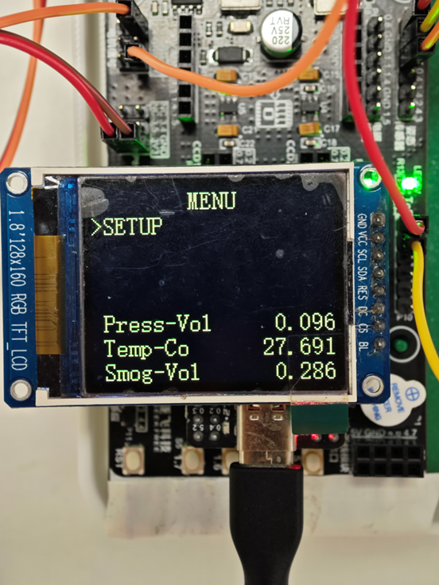

通过按下按键1、2控制光标“>”上下移动指向设置“SETUP”，按下按键3确定进入参数设置界面。

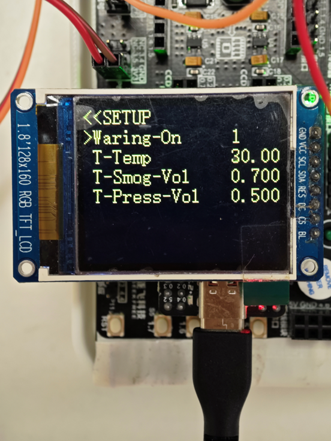

控制光标“>”上下移动指向想要修改的参数，按下按键3选定后即可通过按键1、2进行值得加、减修改，在修改过程中可以按下按键3切换单次加、减值得单位量，修改完毕后按下按键4即可返回上一级菜单。

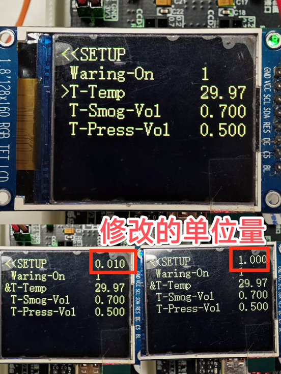

#### 2.4 EEPROM刷写保存

EEPROM的主要功能是断电保持存储数据。这些数据可以是设备的配置参数、校准信息、用户设置、固件更新信息等。由于其非易失性特性，即使在没有电源供应的情况下，存储在EEPROM中的数据也能得以保留。EEPROM是一种非易失性存储器，即在系统断电后，存储在其中的数据不会丢失，这对于需要长期保存重要数据的应用场景尤为重要。

本系统无需外置存储芯片，利用STC32F内部集成的EEPROM进行断电数据保存。在主界面，按下按键4出现如图提示后，即可将参数写入EEPROM，确保断电或重启时，系统能快速恢复到先前设置状态，保证连续运行。

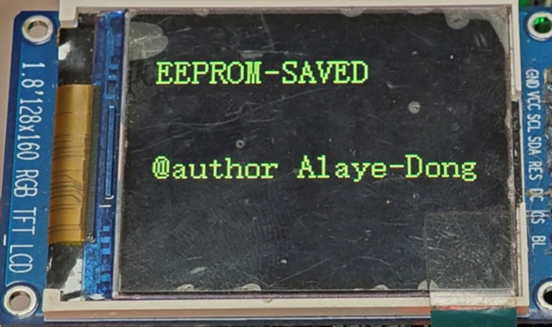
